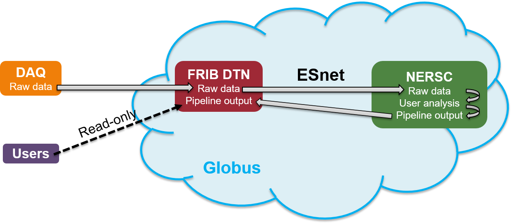

# Automated Data Analysis Using Globus Flows
A. Chester  
Facility for Rare Isotope Beams  
640 S. Shaw Ln.  
East Lansing, MI 48924 USA  

5 March 2024  

## Introduction
This repository contains an automated workflow example for FRIB data analysis used during FDSi experiment e21062B (PI: H. Crawford) which ran 27 Feb. to 4 Mar. 2024. The workflow utilizes the computational resources available at NERSC to increase the throughput for compute-intensive tasks such as fitting ADC trace data. High-speed data transfer between FRIB and NERSC is done over ESnet, and the entire workflow--data transfer and analysis--is managed using a Globus Flow. Some familiarity with Globus, HPC computing (specifically at NERSC), and the e21062 analysis methods are assumed, though the overall framework is general enough to apply to other use cases. The e21062 flow software is written primarily in Python and makes heavy use of the Globus SDK.

## Globus Flows
A Globus Flow is composed of a series of _action providers_, which perform _actions_ as part of a _flow_. The service to run a file transfer between Globus collections is an example of an action provider. The associated action contains the results, status, and metadata associated with a particular invocation of the transfer action provider. A flow is a single operation which incorporates (possibly many) action providers in a defined order: for example, copying data from a source collection to a destination collecting via some intermediary collection. Starting a flow with a particular set of inputs is called a _run_ or _flow run_. A number of action providers are hosted by Globus and can be used to construct custom flows.

### Flow Definitions
A flow _definition_, perhaps unsurprisingly, defines the relationship between the actions of a flow, implemented as a type of state machine. Flow definitions are JSON-formatted files written using a derivative of the Amazon States Language specific to Globus Flows. A simple transfer flow definition could consist of a single transfer action run by the transfer action provider.

### Flow Inputs
The input to a flow is known as an _input document_. Many (if not all) couture flows require custom inputs. A flow's _input schema_ can be used to validate a user's input document. If the input document does not conform to the expected format defined by the input schema, the flow run will not start. Input documents and schema are written in the JSON schema format. Returning to the transfer example above, a transfer flow input schema could require source and destination paths as part of an input document. Any input documents which do not specify these paths are not valid.

### Globus Compute
Globus Compute provides a "Function-as-a-Service" (FaaS) platform, allowing user's to execute their code using a remote _compute endpoint_. The endpoint is run by the user and provides an interface which allows for remote function execution on some host system. Resource requirements and scaling are defined as part of the endpoint configuration. Remote execution of a function is performed by either calling the `.submit()` method of the Globus Compute `Executor` class or using the Globus Compute `Client` batching. Pre-registered functions can be invoked using both of these methods. Parsl is used by the Globus Compute platform to manage resources specified by the endpoint configuration. At NERSC, Parsl must interact with the Slurm scheduler to submit tasks to allocated resources.

## e21062 Example Flow
The author assumes the user has:
1. An account at NERSC which is part of the e21062 analysis project m4386.
2. Familiarity with the [FRIBDAQ parallel trace fitting software](https://github.com/FRIBDAQ/DDASToys).
3. A working knowledge on how to run jobs at NERSC.
4. Installed the Globus SDK and Globus Compute SDK following the instructions on their respective documentation pages of by running `pip install -r requirements.txt` from inside the a Python virtual environment. Both SDKs require Python 3.10 or later; if your OS or containerized RTE does not support Python 3.10, you may need to run under one of the official Docker Python images (or e.g. an Apptainer image built from one of the Docker images) found [here](https://hub.docker.com/_/python).
5. The permissions to write pipeline output on the FRIB DTN.

The `transfer_compute` flow contained in this repository uses a combination of transfer and compute action providers to copy FRIB data to NERSC, perform user analysis on the Perlmutter supercomputer, and copy the results back to FRIB. This is done through the FRIB DTN which can communicate with the Globus cloud. A schematic of the data analysis pipeline is shown below, with the steps run using Globus Flows shown inside the blue cloud.

### Installing, Configuring, and Running the e21062 Example Flow
- Clone the repository `git clone https://github.com/aschester/flows_e21062.git` somewhere which can mount the Ceph filesystem visible to the FRIB DTN.
- Copy the `globus_flows` directory to NERSC. This directory contains the jobs scripts which are remotely executed by the compute functions in this repository as well as endpoint monitoring tools.
- Open `transfer_compute_mpi.py` and ensure that the collection, endpoint, compute function, and flow UUIDs, and top-level paths are correct. Update the UUIDs and paths as necessary. See the section on [script usage](#script-usage) for details. The flow will check whether the directory structure defined in `transfer_compute_mpi.py` exists and create it if it does not.
- Verify that the endpoint configuration is correct (correct queue, shape of provisioned resources, etc.) and start the compute endpoints at NERSC. If the compute endpoints do not exist, got to `globus_flows/ep_launch` and run `create.sh` to create, configure and start the `frib-fit-mpi`, `frib-convert` and `frib-analysis` endpoints.
- (Optional) Turn on the endpoint monitoring. For an experiment, it is a good idea to ask for access to the workflow queue for long-lasting scrontab (Slurm crontab equivalent) jobs. Ensure that the `--dependency=singleton` and `--open-mode=append` options are set for long-running jobs to prevent Slurm from starting multiple instances of the monitor. See the [scrontab documentation](https://docs.nersc.gov/jobs/workflow/scrontab/) for details.
- Run a flow. Note that this must be done from inside the Python virtual environment where the Globus SDK and Globus Compute SDK are installed. The `venvcmd` script provides a shortcut: `./venvcmd ./transfer_compute_mpi.py --rundir /path/to/toplevel/directory/rundir`. You can monitor the status of the flow on the [Globus Web App](https://app.globus.org/runs).
- (Optional) Configure the flow to run automatically. Rather than starting a flow run by hand, it is possible to run the flow in a mode where it will monitor a filesystem on the DTN for new run directories and trigger flows automatically once one is discovered. To watch a directory for events and automatically trigger the flow, run the script as `./venvcmd ./transfer_compute_mpi.py --watchdir /path/to/toplevel/directory`. It may be helpful to background this process and log the output: `nohup ./venvcmd ./transfer_compute_mpi.py --watchdir /path/to/toplevel/directory >> watcher.log 2>&1 &`.

### Script Usage

## Documentation/Further Reading
- [NERSC](https://docs.nersc.gov/)
- [Globus Flows](https://docs.globus.org/api/flows/)
- [Globus SDK](https://globus-sdk-python.readthedocs.io/en/stable/installation.html)
- [Amazon States Language](https://docs.aws.amazon.com/step-functions/latest/dg/concepts-amazon-states-language.html)
- [JSON schema format](https://json-schema.org/learn/getting-started-step-by-step)
- [Globus Compute](https://funcx.readthedocs.io/en/latest/endpoints.html)
- [Parsl](https://parsl.readthedocs.io/en/stable/#)
- [Slurm](https://slurm.schedmd.com/)
- The Globus Flows scripts are derived in whole or in part from the [globus-flows-trigger-examples](https://github.com/globus/globus-flows-trigger-examples) repository and are redistributed under the Apache-2.0 license.